# Quiz App

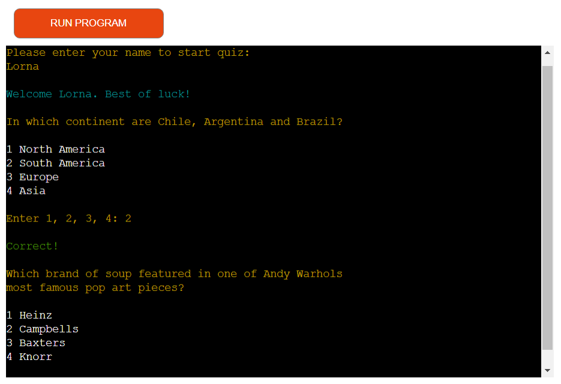

## Introduction
This quiz app contains 10 general knowledge multiple choice questions. The user will be given 4 possible answers with each question. All labelled 1-4. If the user gets the correct answer, they will receive a 'Correct' message. If the user gets the answer wrong. The 'Incorrect' message will display along with the correct answer. The user can keep going until they answer all 10 questions. They will receive a score marked out of 10 at the end. Their name and score will be exported to a google sheet.

View the live application [here.](https://pp3-quiz-lv.herokuapp.com/)

## User Experience - UX

### Application Goal

To allow users to enjoy a simple quiz game. They can have as many chances as they want to complete the game. They may pick up some general knowledge while they are playing.

### User Stories

#### As a user

* As a user I want to see a menu option called 'Start Quiz'. When I select this the quiz game will begin.
* As a user I want to see a menu option called 'Instructions'. When I select this the game instructions will load.
* As a user after I read the instructions, I want to be able to enter a menu option.
* As a user I want to see a menu option called 'Quit'. When I select this, I will see a goodbye message.
* As a user I want to enter my name at the start of the game.
* As a user I want to see a quiz question with 4 possible answers.
* As a user I want to option to enter 1-4 to answer the quiz question.
* As a user I want to see a 'Correct' message when I answer the quiz question correctly.
* As a user I want to see an 'Incorrect' message along with the correct answer if I get a quiz question wrong.
* As a user I want to see my score after I have answered all 10 questions.
* As a user I want the option to play the game again after completing a game. I want to be able to choose yes or no.
* As a user I want to a view a leaderboard with the top 10 usernames and scores.

#### As a website owner

* As a website owner I want to capture the users name and final score and export the data to a google sheet for storage.

## Design

### Flowchart

The flowchart was created and used to map out the user journey. This helped make sure that the user always has somewhere to go. It identified places in the game where the user had the potential to get blocked and ensured we gave them a way out. 

## Features

### Existing Features

* Main Menu

  The main menu allows the user to select from 4 options. They can start the quiz game, read the instructions, look at the leader board or quit. They are prompted to enter an option numbered 1-4. If they enter an invalid option, they will keep being prompted to enter an option until a valid option is entered.

  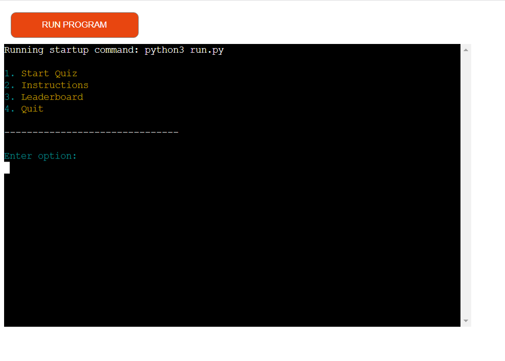

* Start Quiz

  The user is prompted to enter in their name. If they try and proceed without entering their name, they will keep being prompted to enter a valid name. They will then see a welcome message and the first question will be displayed.

  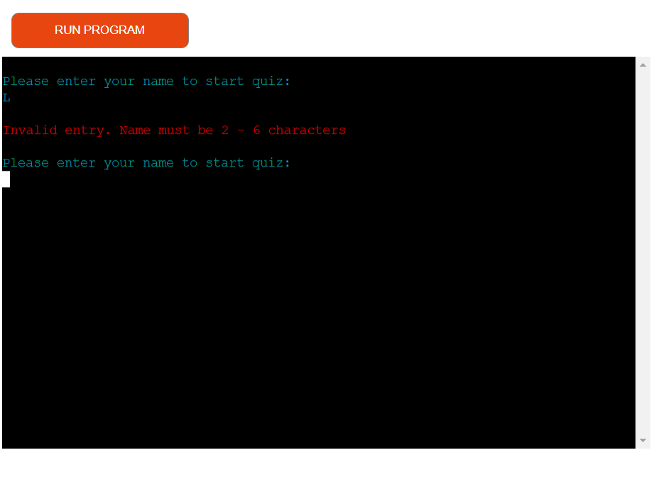

  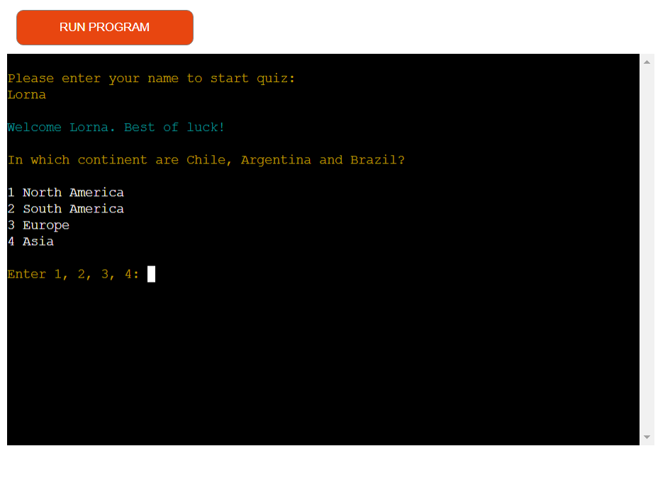

* Instructions

  The user can choose thia option to view the game instructions. They will be able to continue by pressing another menu option once they are finished with the instructions.

  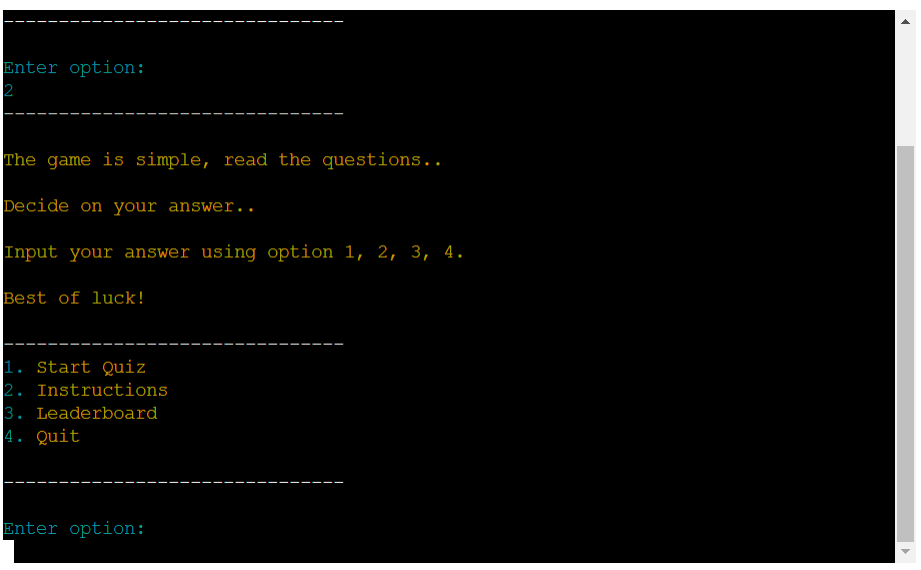

* Leader board

  Using google sheets the username and score will be exported and saved to the sheet. This will then display a leaderboard of the top 10 scores and the corresponding user name.

  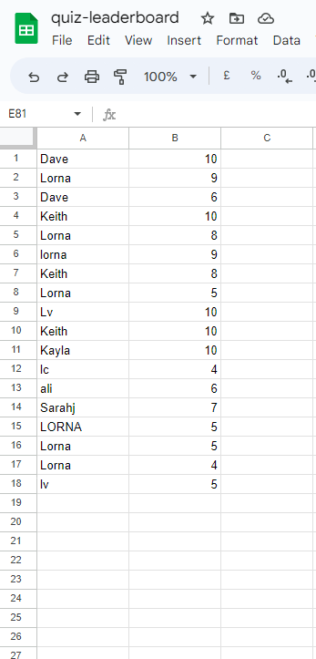

  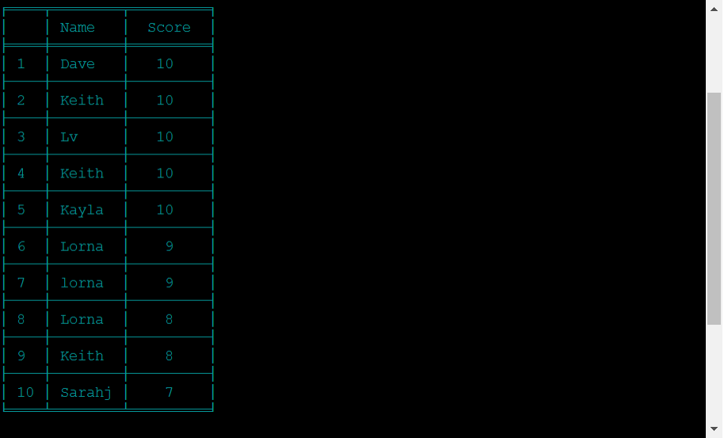

* Quit

  This option gives the users the option to quit from the main menu.

  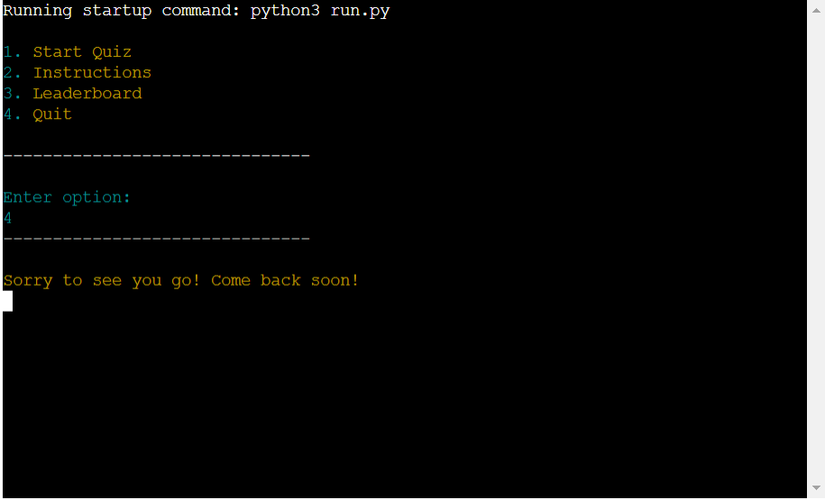

* Questions and possible answers

  The user will see a question displayed with a list of possible answers listed from 1-4. The user is prompted to enter 1, 2, 3 or 4. If the user enters an invalid option they will be prompted to try again until a valid option is entered.

  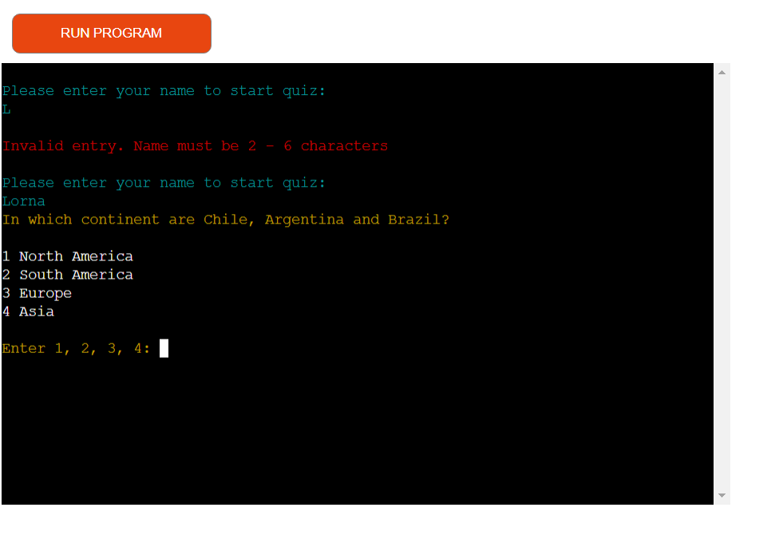

  

* Question Validation

  If the user gets the answer correct, they will see the Correct! message display on screen.

  If the user gets the answer incorrect, they will see the Incorrect! messages display on screen alongside the correct answer.

  

  

* Final score

  After the user has answered 10 questions, they will see a final score be displayed with their name.

  

* End game function

  The user will be asked if they want to play again. If they enter 'Y' a new game will start. 

  If they enter 'N' they will be shown a goodbye message and the game will be over.

  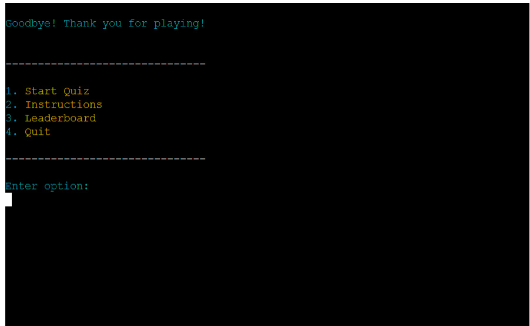

### Future Features

* I would like to implement more styling throughout the application including some graphics.
* I would like to include more questions and import them from an API or storage in google sheets and then have them pulled in at random so that the same user can play 
  the game over and over and not get bored and not get too familiar with the answers.

## Testing

### CI Python Linter Testing

No errors found on run.py file

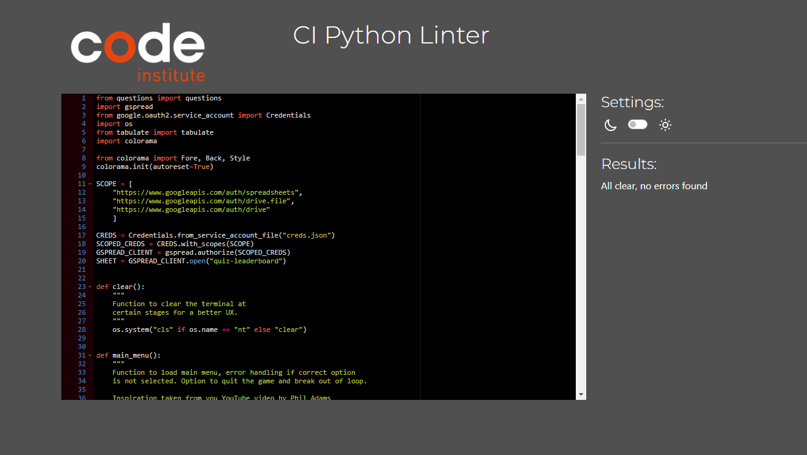

No errors found on questions.py file

### Manual testing based on user stories

* Mannual testing was carried out on Edge & Chrome browsers using a Windows 10 desktop.

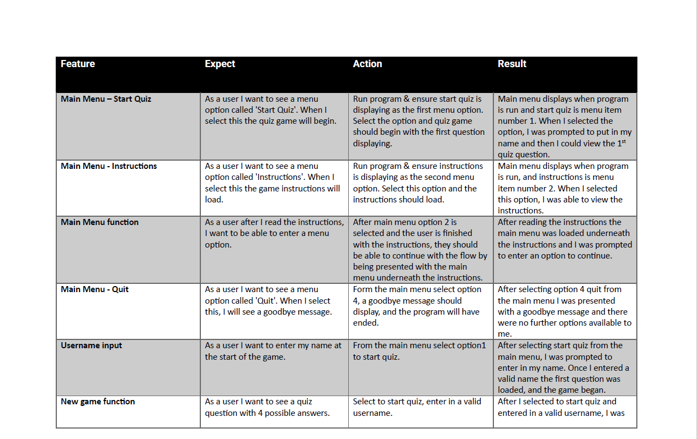

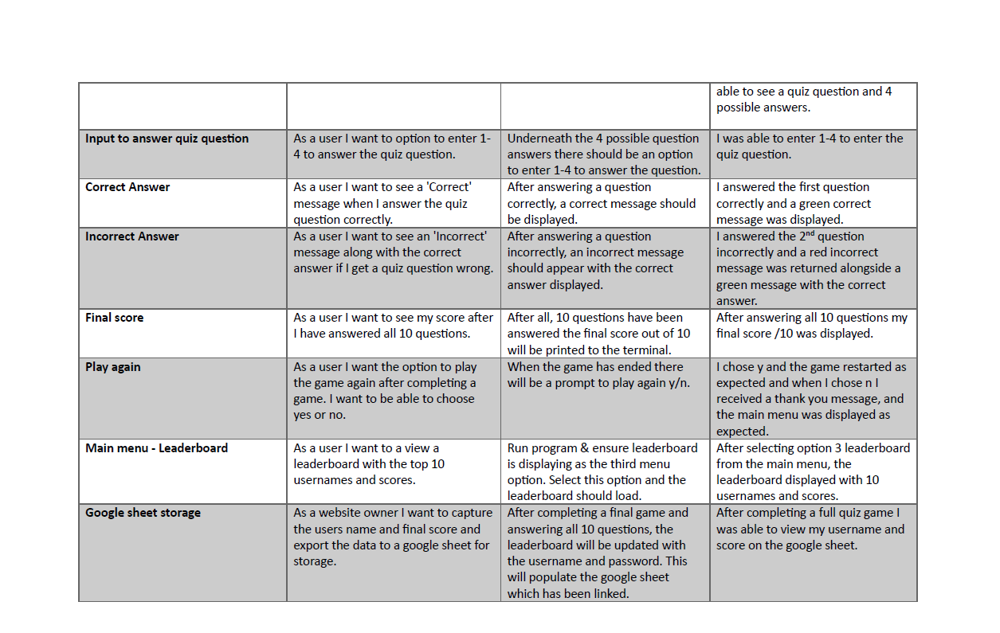

### Error Handling

Error handling has been implemented where relevent throughtout the application. This prevents the user getting blocked at a step or getting thrown out of the application. It will also help prevent bugs and incorrect data from being entered.

  * Main Menu - User must enter an potion for 1-4 to proceed. 
  
    [Error Main Menu](documentation/images/error_main_menu.png)

  * Enter Name - The user must enter a name with a minimum of 2 letters and a maximum of 6. 

    [Error Enter Name](documentation/images/error_enter_name.png)

  * Answering Quiz Questions -  The user must input an option of 1-4 anything outside of this will receive an error. And the while loop will ensure that the user keeps getting asked to input the correct answer before proceeding.

    [Error Answer Question](documentation/images/error_answer_question.png)

  * End Game - After all the quiz questions have been completed the user has the option to play again. This should be answered using Y/N .lower() has been addedd to this input to accept lower case y/n also. If anything else is entered the user will receive an error.

    [Error End Game](documentation/images/error_end_game.png)

## Unfixed Bugs

* Not aware of any unfixed bugs at the time of deployment. A try/except with nestled if/else statements has beem put in place to catch any errors. 

## Bugs encountered

* Strings being too long for the terminal and receiving an erorr when passing through the linter. This came up for me quite a bit especially with the quiz questions and also when I started to add on hte colorama syntax. When I thought I may have fixed the formatting I would deploy it and some strings were displaying with their blank spaces meaning that the strings were printed to the temrinal making it unreadable.

The fix: by using multi line strings with the """ syntax sorted by issue after lots of trial and erorr and moitoring the code through the linter to ensure there were no errors with the way i formatted it.

* Strange behaviour with the game over function - it was my mentor that reported this issue to me and I could not recreate it myself. The issue was when you see the promt 'Do you want to play again?' at the end of the game, if you typed in N you would see the first quiz question. As memtioned I could not recreate this so I turned to my peers I received feedback from 1 guyt to say he played it 3 times with no issue. And another was getting really inconsistent behaviour. It was him that suggested that i had an unnecessary inout in the function. So I simplified it and also added in the option where they are returned to the main menu if they select N for 'Do you want to play again?'. I am hoping this bug is gone now.

## Deployment

### Heroku deployment

About mid may through the final product I deploed the app in Heroku to ensure there were no issues. From then I mannually deployed the branch each time I pushed something new. I followed the below steps:

* Created my account ang log in through the [Heroku](heroku.com) website.

### Fork repository

## Technologies Used

### Languages

### Frameworks and Tools

## Credits

