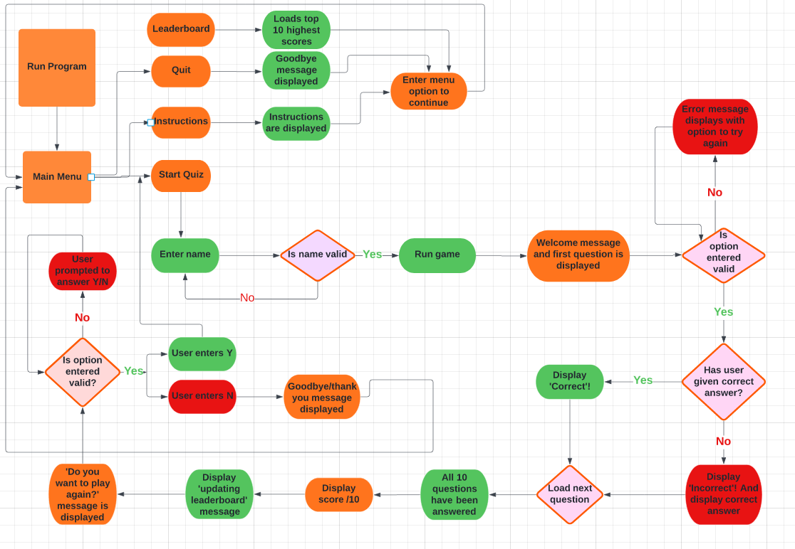

# Quiz App

## Introduction
This quiz app contains 10 general knowledge multiple choice questions. The user will be given 4 possible answers with each question. All labelled 1-4. If the user gets the correct answer, they will receive a 'Correct' message. If the user gets the answer wrong. The 'Incorrect' message will display along with the correct answer. The user can keep going until they answer all 10 questions. They will receive a score marked out of 10 at the end. Their name and score will be exported to a google sheet.

View the live application [here.](https://pp3-quiz-lv.herokuapp.com/)

## User Experience - UX

### Application Goal

To allow users to enjoy a simple quiz game. They can have as many chances as they want to complete the game. They may pick up some general knowledge while they are playing.

### User Stories

#### As a user

* As a user I want to see a menu option called 'Start Quiz'. When I select this the quiz game will begin.
* As a user I want to see a menu option called 'Instructions'. When I select this the game instructions will load.
* As a user after I read the instructions, I want to be able to enter a menu option.
* As a user I want to see a menu option called 'Quit'. When I select this, I will see a goodbye message.
* As a user I want to enter my name at the start of the game.
* As a user I want to see a quiz question with 4 possible answers.
* As a user I want to option to enter 1-4 to answer the quiz question.
* As a user I want to see a 'Correct' message when I answer the quiz question correctly.
* As a user I want to see an 'Incorrect' message along with the correct answer if I get a quiz question wrong.
* As a user I want to see my score after I have answered all 10 questions.
* As a user I want the option to play the game again after completing a game. I want to be able to choose yes or no.

#### As a website owner

* As a website owner I want the quiz game to contain 10 questions with 4 possible answers to each question. I want 1 question to load at a time. Once a question has been answered the next one should load this should continue until all 10 questions have loaded.
* As a website owner I want to capture the users name and final score and export the data to a google sheet for storage.

## Design

### Flowchart

The flowchart was created and used to map out the user journey. This helped make sure that the user always has somewhere to go. It identified places in the game where the user had the potential to get blocked and ensured we gave them a way out. 

## Features

### Existing Features

* Main Menu

  The main menu allows the user to select from 4 options. They can start the quiz game, read the instructions, look at the leader board or quit. They are prompted to enter an option numbered 1-4. If they enter an invalid option, they will keep being prompted to enter an option until a valid option is entered.

* Start Quiz

  The user is prompted to enter in their name. If they try and proceed without entering their name, they will keep being prompted to enter a valid name. They will then see a welcome message and the first question will be displayed.

* Questions and possible answers

  The user will see a question displayed with a list of possible answers listed from 1-4. The user is prompted to enter 1, 2, 3 or 4. If the user enters an invalid option they will be prompted to try again until a valid option is entered.

* Question Validation

  If the user gets the answer correct, they will see the Correct! message display on screen.

  If the user gets the answer incorrect, they will see the Incorrect! messages display on screen alongside the correct answer.

* Final score

  After the user has answered 10 questions, they will see a final score be displayed with their name.

* Leader board

  Using google sheets the username and score will be exported and saved to the sheet.

* End game function

  The user will be asked if they want to play again. If they enter 'Y' a new game will start. 

  If they enter 'N' they will be shown a goodbye message and the game will be over.

### Future Features

* I would like to implement more styling throughout the application including some graphics.
* I would like to include more questions and import them from an API or storage in google sheets and then have them pulled in at random so that the same user can play 
  the game over and over and not get bored and not get too familiar with the answers.

## Testing

### CI Python Linter Testing

All clear no errors found 

#### Add screenshot when all code is complete

### Manual testing based on user stories

#### Add table with feature, expect, action, result

### Lighthouse testing

## Unfixed Bugs

## Deployment

### Heroku deployment

### Fork repository

## Technologies Used

### Languages

### Frameworks and Tools

## Credits

